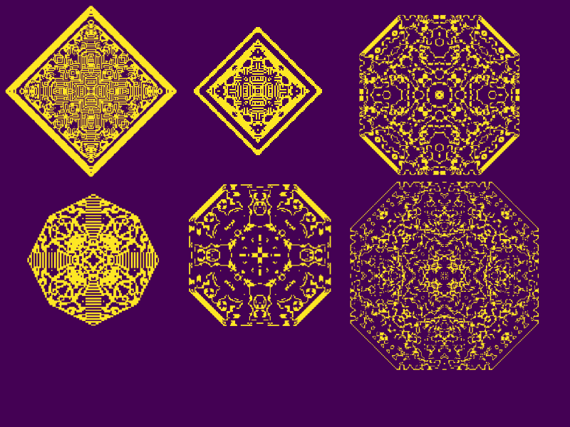
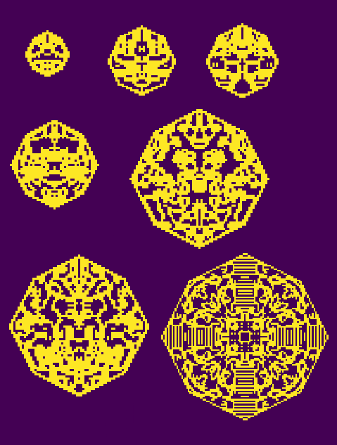
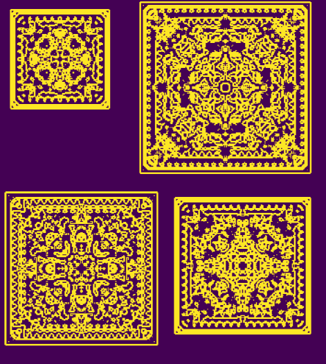

# CAPatterns
This simple python program  generates amazing patterns by the repetition of simple rules(inspired by cellular automata)

It is fascinating how when you repeat applying a simple set rules on a couple of points in a two dimensional space, you will come up with mind boggling patterns.
Here in this programs I start by a few points and then these points reproduce and die according the population around them.
All these python files are basically the same program with modified sets of rules.

you can come up with totally different result by changing:

1. Initilal points.
2. when a pixel is born by changing this line "if s>2 and s<7 :" in test0.py for instance.(when there are more than 2 and less than 7 pixels around)
3. when a pixel dies by changing this line "if s >7 :" in test0.py for instance.(when there are more than than 7 pixels around)
4. changing the size of the window: this line  : "s= np.sum(space[i-1:i+2,j-1:j+2])" here the window's size is 3x3

Here you can see some of the results:

